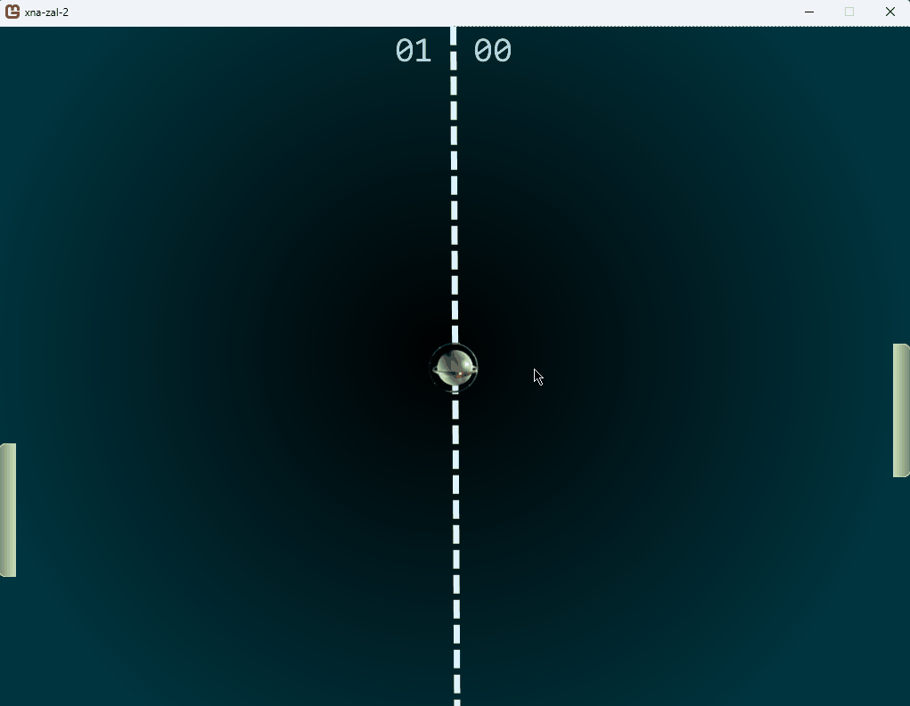

# XNA platform examples

Monorepo contains XNA (Monogame) platform 2D and 3D examples created during CS studies.

## Subprojects:
* xna-zal1:

* xna-zal2:

* xna-zal3:

* xna-zal4:

## Author
Created by Miłosz Gilga. If you have any questions about the application send message: personal@miloszgilga.pl.

## License
This program is on GNU-GPL 3.0 license.
